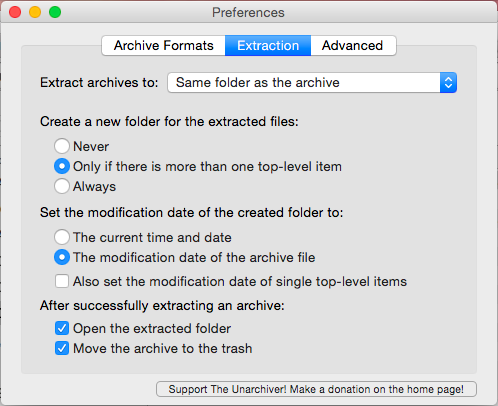

# Application Settings

Let me help you with that Merry. Here, take a couple more settings. This time is for the settings in some of the key applications we've downloaded previously. 

Ah, there's more screenshots. Yup, I'm still feeling lazy.

#### The Unarchiver

### Google Chrome

Chrome settings are pretty standard, so I won't bother with those. And even tough extensions are automatically synced, I feel like posting my extensions here help sharing your current Chrome extension. So go ahead people, create a PR and add your own:

* **Adblock Plus**: I hate adds. [And I'm not the only one](http://cdn.static-economist.com/sites/default/files/imagecache/original-size/images/print-edition/20150606_WBC471.png)
* **Dropbox for Gmail**: I must for Dropbox users. you can send and preview Dropbox files and links without leaving your Gmail window.
* **Print Friendly & PDF**: Quick and easy way to create a pdf documents from any webpage.
* **Session Buddy**: Easy and simple management of your browser sessions. I use it to save pages from a certain topic I'm working on, without keeping them eternally open.

### Alfred
There are many little configurations you can do in Alfred, here are the ones I use:
* I start by setting the Alfred hotkey the same as the ex-Spotlight hotkey (CMD+Space). 
* In *General Tab > Contacts > Email*, you can set Gmail webclient as your default email tool.
* In *General Tab > System* activate `eject` option to eject removable media
* In *Appearance > Options* I select to hide both the Alfred hat from the bar, and the Alfred menubar icon.
* In *Features > Terminal* selected your correct terminal application (e.g. *iTerm2*)

I also use a couple of interesting workflows, namely:
* **[alfred-terminalfinder](https://github.com/LeEnno/alfred-terminalfinder)**: workflow to open current Finder window in Terminal/iTerm and vice versa.
* **[alfred-convert](https://github.com/deanishe/alfred-convert)**: workflow for connvert between different units
* **[spotifious](https://github.com/citelao/Spotify-for-Alfred)**: a natural Spotify controller

