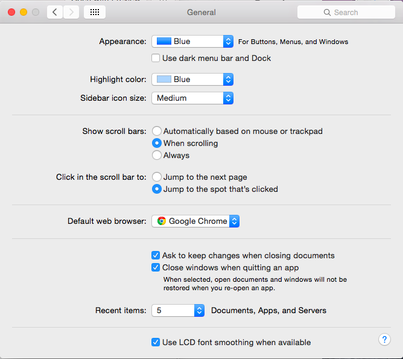
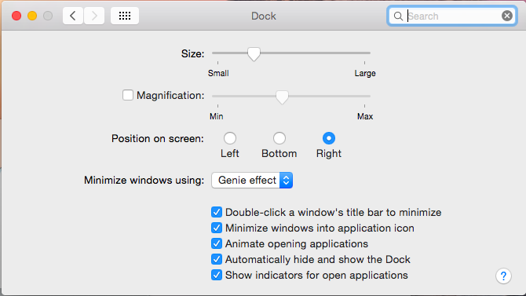
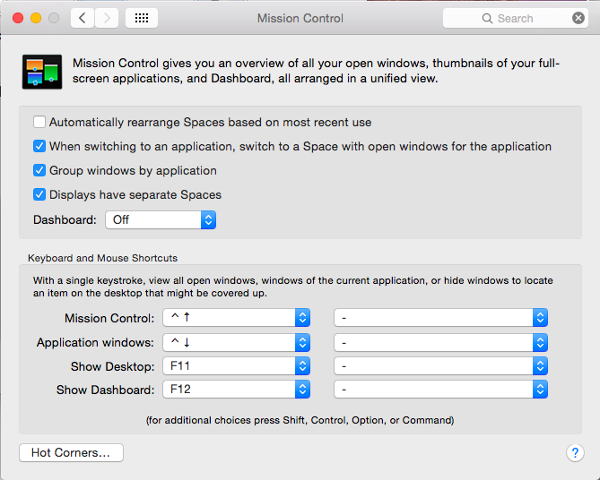
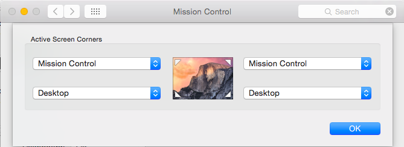
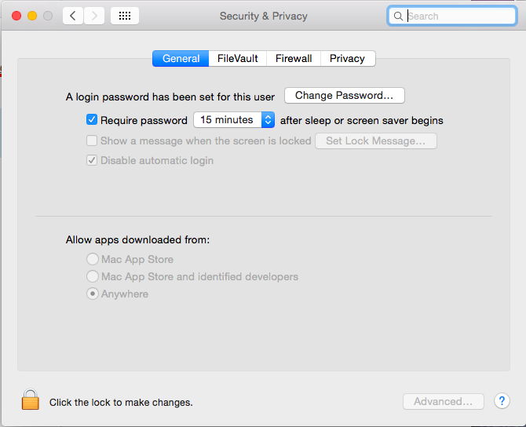

# General Settings

Is that a bunch a screenshots? Yup! There's a screenshot for each main OSX Yosemite *Systems Settings* panel, so next time I know exactly my settings.

* General

* Dock

* Mission Control

* Hot Corners

* Security & Privacy
    * I changed my password to use a one different from my iCloud account.
    * I also turned on Firewall. Better safe than sorry.

