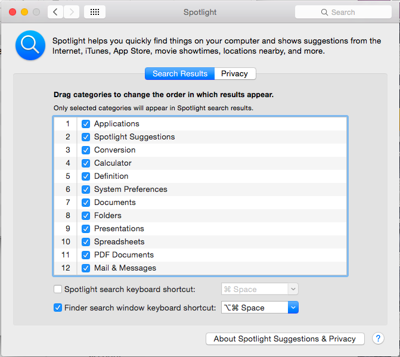

# General Settings


Is that a bunch a screenshots? Yup! There's a screenshot for each main OSX Yosemite *Systems Settings* panel, so next time I know exactly my settings.

#### General


#### Dock


#### Mission Control


#### Hot Corners


#### Security & Privacy


I changed my password to use a one different from my iCloud account. I also turned on Firewall. Better safe than sorry.


#### Spotlight



As you can notice, I disable Spotlight shortcut. And that's because I use an even better app: [Alfred](http://www.alfredapp.com/). Hence, I disable the Spotlight shortcut and use that one for Alfred. 

Furthermore, I disable spotlight shortcut from the menubar with the following terminal command (reboot after):

```shell
sudo chmod 600 /System/Library/CoreServices/Search.bundle/Contents/MacOS/Search
```

This does not completely disable Spotlight, it only removes its GUI. To re-enable it, just do (reboot after):

```shell
sudo chmod 755 /System/Library/CoreServices/Search.bundle/Contents/MacOS/Search
```

#### Notifications

First of all I removed the apps I don't use: Mail and Safari. Then I edited my notification center with the just the widgets that I use: Social, Calendar, iTunes, Weather.


#### iCloud

On iCloud I removed the apps that I don't use: Mail and Safari. Then, I setup iCloud Drive, Photos sharing with iOS, Keychain and Back to my Mac.

#### Finder

If you find yourself trying to open a dotfile via terminal, and doing this: ```open .bashrc```; then this might be the tip for you. The best assign your favorite editor to all plain text files. For example (for Atom):
```
defaults write com.apple.LaunchServices LSHandlers -array-add '{LSHandlerContentType=public.plain-text;LSHandlerRoleAll=com.github.atom;}'
```

Replace ```com.github.atom``` with your editor's string. This can be found in the app's Info.plist. Right click the app in question and click on *Show package contents > Open Contents-> open Info.plist*. Locate the key `CFBundleIdentifier` the string value below is the string in question.

