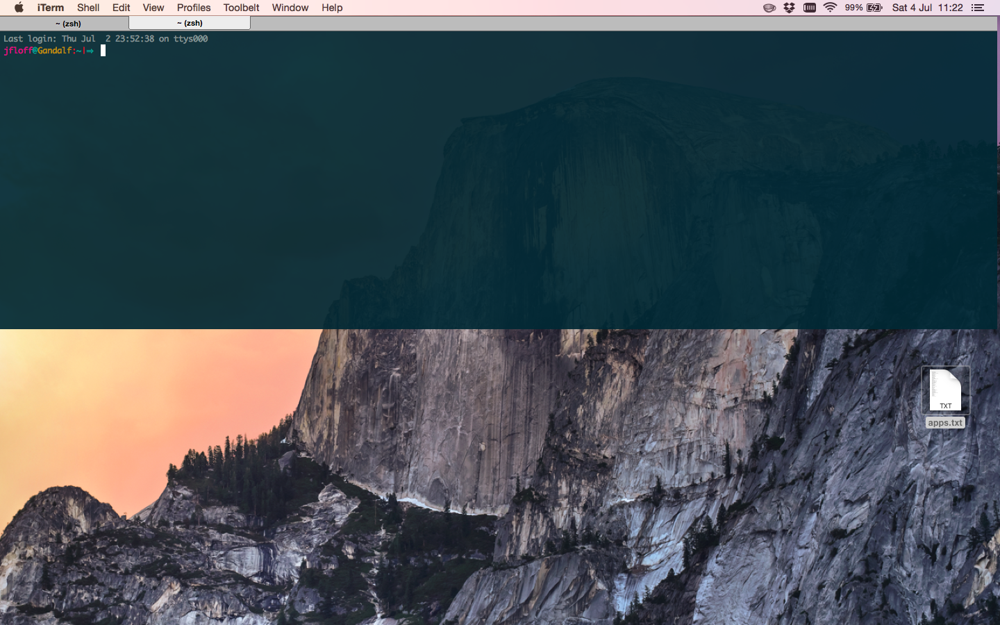

# iTerm 
If you're still using Terminal, stop it. Right now. Just close it, remove the shortcuts and do yourself a favour: install **[iTerm2](https://www.iterm2.com/)**. Future you will thank both you and me.


### Terminal Drop down

iTerm 2 has a very useful and timesaving feature where you can make the terminal dropdown from the top of the screen with just a key press. Very useful if you need access to the terminal quickly, and don’t want to alt + tab to eternity.



To enable this, go to *iTerm > Preferences > Profiles - Default > Window*, here you should see a dropdown menu called "Style". Choose **"Top of screen"** in the dropdown. Also, you might want to up the transparency a bit, so you can see while typing. 

Finally, we set a **system-wide hotkey**. Under *Keys > Hotkey* section, enable **“Show/hide iTerm2 with a system-wide hotkey”** and input your hotkey combination, e.g. ```Ctrl + Shift + L```. 


### Colors Settings

First of all [download](https://github.com/altercation/solarized/tree/master/iterm2-colors-solarized) the Solarized color palette. This palette is designed to be very legible, and easy for your eyes.

Then, go to *Preferences* and load the Solarized Dark file that you just unzipped (click on 'Load Presets' and select the file):


Now, if your terminal doesn't look like this...


Don't worry, I've been there... (I want my 3 hours back!). But stay calm, lets be a good Hobbit and try each one of these steps:
* Confirm you iTerm terminal type in *Profiles - Default > Terminal > Report Terminal Type*, set to **```xterm-256color```**. Then add the following lines to .bashrc:

```shell
# Set CLICOLOR if you want Ansi Colors in iTerm2 
export CLICOLOR=1

# Set colors to match iTerm2 Terminal Colors
export TERM=xterm-256color
```
* Check if *Profiles - Default > Colors > Minimum Contrast* value it's high. If it is you might only get black and white.
* Uncheck the "Draw bold text in bright color" in *Profiles - Default > Text*.

### Shortcuts
Since I’m not a vi or emacs pianist, I prefer standard Apple Text bindings when editing the command line, so I set them up in *Global Shortcut Keys* under *Keys* tabs:

* **⌥←**: Go left one word (Send Escape Sequence | b)
* **⌥→**: Go right one word (Send Escape Sequence | f)
* **⌘←**: Go to start of line (Send Hex Code | 0x01)
* **⌘→**: Go to end of line (Send Hex Code | 0x05)
* **⌥←Delete**: Delete word (Send Hex Code | 0x1B 0x08)
* **⌘←Delete**: Delete line (Send Hex Code | 0x15)
    
### Other settings
* **Open tab/pane with current working directory:** go to *Profiles - Default > General** and set **Working Directory** to *“Reuse previous session’s directory”.
* **Disable bell:** go to *Profiles - Default > Terminal* and check the **"Check silence bell"** checkbox.

<br>

That's right, we've fallen into ***shell's darksness***!
