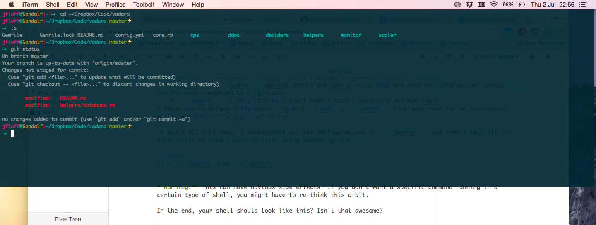
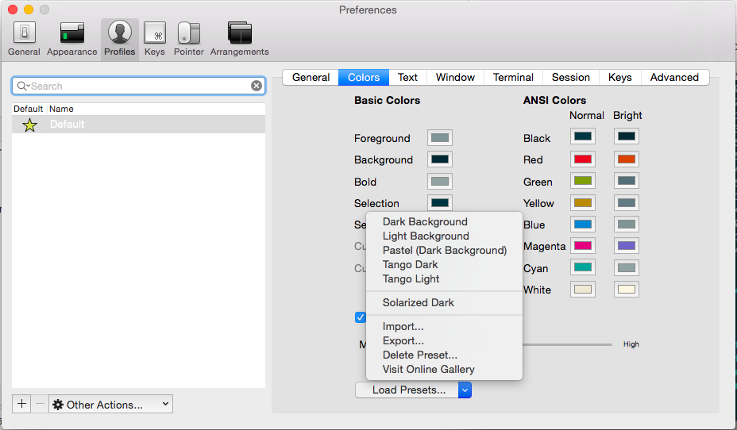

# Shell

The shell is the bread and butter of any developer. Hence you should the right amount of time configuring it to fit your needs, and to make sure you maximize your performance while using it.

Many people use the command line every day and never bother to customize their prompts. It's just like Bilbo says: if you intend to ride a horse all day, you need to learn how to ride a horse.


### Shell Config Files

As I was researching this I found myself in a bit of confusion between ```.bashrc```,  ```.bash_profile```, ```.profile```, etc. [This](http://stackoverflow.com/a/415444) answers explains the difference very nicely, but in a nutshell:
* ```.profile``` is simply the login script filename originally used by ```/bin/sh```.
* ```.bashrc```, ```.zshrc```, amongst others are config files that are read by "interactive" shells (as in, ones connected to a terminal.
    * ```.bashrc``` is only read by a shell that's both interactive and non-login
* Other shells behave differently - eg with ```zsh```, ```.zshrc``` is always read for an interactive shell, whether it's a login one or not.

To avoid all this mess, I concentrate all the configurations in ```.bashrc```, and then I tell all the other files to read from that file, using something like:

```shell
[[ -r ~/.bashrc ]] && . ~/.bashrc
```

**Warning:** This can have obvious side effects. If you don't want a specific command running in a certain type of shell, you might have to re-think this a bit.

In the end, your shell should look like this? Isn't that awesome?




### iTerm 
If you're still using Terminal, stop it. Right now. Just close it, remove the shortcuts and do yourself a favour: install **[iTerm2](https://www.iterm2.com/)**. Future you will thank both you and me.


#### Terminal Drop down

iTerm 2 has a very useful and timesaving feature where you can make the terminal dropdown from the top of the screen with just a key press. Very useful if you need access to the terminal quickly, and don’t want to alt + tab to eternity.

To enable this, go to *iTerm > Preferences > Profiles - Default > Window*, here you should see a dropdown menu called "Style". Choose **"Top of screen"** in the dropdown. Also, you might want to up the transparency a bit, so you can see while typing. 

Finally, we set a **system-wide hotkey**. Under *Keys > Hotkey* section, enable **“Show/hide iTerm2 with a system-wide hotkey”** and input your hotkey combination, e.g. ```Ctrl + Shift + L```. 


#### Run at startup

Now for the previous setting to work really well, your iTerm should be always on. To do that


#### Colors Settings

First of all [download](https://github.com/altercation/solarized/tree/master/iterm2-colors-solarized) the Solarized color palette. This palette is designed to be very legible, and easy for your eyes.

Then, go to *Preferences* and load the Solarized Dark file that you just unzipped (click on 'Load Presets' and select the file):



Now, if your terminal doesn't look like this,


don't worry! I've been there... (I want my 3 hours back!). But stay calm, lets be a good Hobbit and try each one of these steps:
* Confirm you iTerm terminal type in *Profiles - Default > Terminal > Report Terminal Type*, set to **```xterm-256color```**. Then add the following lines to .bashrc:

```shell
# Set CLICOLOR if you want Ansi Colors in iTerm2 
export CLICOLOR=1

# Set colors to match iTerm2 Terminal Colors
export TERM=xterm-256color
```

* Check if *Profiles - Default > Colors > Minimum Contrast* value it's high. If it is you might only get black and white.

* Uncheck the "Draw bold text in bright color" in *Profiles - Default > Text*.
* 

#### Other settings
* **Open tab/pane with current working directory:** go to *Profiles - Default > General** and set **Working Directory** to *“Reuse previous session’s directory”.
* **Disable bell:** go to *Profiles - Default > Terminal* and check the **"Check silence bell"** checkbox.
* **Change shortcuts:** Since I’m not a vi or emacs pianist, I prefer standard Apple Text bindings when editing the command line, so I set them up in *Global Shortcut Keys* under *Keys* tabs:
    * ⌥←: Go left one word (Send Escape Sequence | b)
    * ⌥→: Go right one word (Send Escape Sequence | f)
    * ⌘←: Go to start of line (Send Hex Code | 0x01)
    * ⌘→: Go to end of line (Send Hex Code | 0x05)


### Oh My ZSH

*[Oh My ZSH](http://ohmyz.sh/)* is a community-driven framework for managing your zsh configuration. The great thing about it is the plugin variety that you can install, and the amazing themes you have at your disposal. All of that paired with an auto-update tool that makes your life much easier.

To install it just run this command:
```shell
curl -L https://raw.github.com/robbyrussell/oh-my-zsh/master/tools/install.sh | sh
```

#### Theme
Now you can customize your shell with a theme, choose one from this [list](https://github.com/robbyrussell/oh-my-zsh/wiki/Themes). In order to enable a theme, set ```ZSH_THEME``` to the name of the theme in your ```~/.zshrc```; for example: ```ZSH_THEME=agnoster```. If you do not want any theme enabled, just set ```ZSH_THEME`````` to blank: ZSH_THEME=""```.

My personal choice is the **pygmalion* theme. To set the theme, open the `~/.zshrc` file and look for the line starting with `ZSH_THEME`. Paste the name of your theme.


#### Plugins

 You can choose the plugins you want from this [list](https://github.com/robbyrussell/oh-my-zsh/wiki/Plugins-Overview). Enable the plugins you want by editing your ```~/.zshrc``` file, just like my plugins:
 
 ```shell
plugins=(atom brew common-aliases encode64 git git-extras github httpie jsontools last-working-dir osx sublime wd colored-man colorize cp extract brew brew-cask vagrant ruby rvm gem docker bundler aws bower)
 ```


